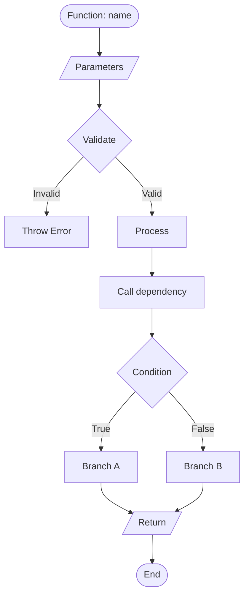
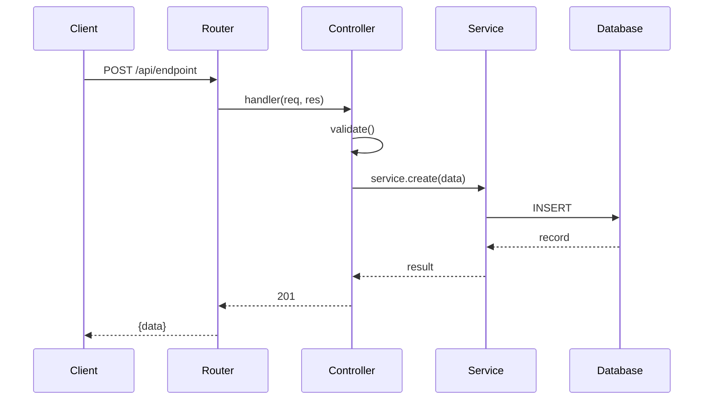
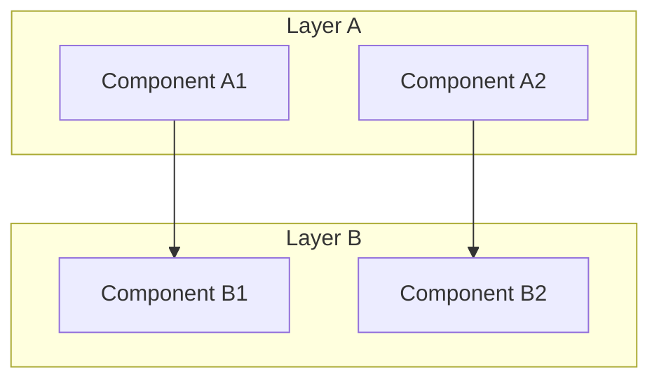
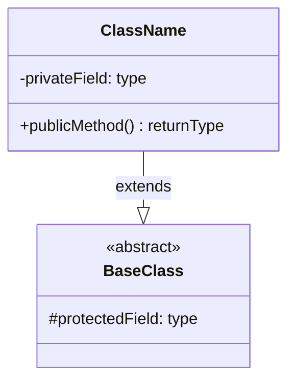

# /capture-knowledge - Codebase Knowledge Capture

Analyze and explain how code works from an entry point (file, folder, function, or API) with recursive dependency analysis and visual diagrams.

## Usage

```
/capture-knowledge <entry-point>
```

**Entry Point Formats:**
- **File**: `src/api/users.ts`
- **Folder**: `src/services/`
- **Function**: `calculateTotalPrice`
- **API Endpoint**: `POST:/api/users`

**Note:** This command will automatically create a knowledge capture file in `docs/ai/implementation/knowledge-{feature-name}.md` using the `docs/ai/implementation/knowledge.md` template.

## Execution Process

### 1. Validate Entry Point
- Determine type (file/folder/function/API)
- Confirm existence using appropriate tools
- Handle ambiguity: list all matches and ask user to specify
- Handle not found: suggest similar names or alternatives

### 2. Collect Context

**For Files:**
- Read file, identify purpose, exports, imports, key patterns
- Extract code snippets for important sections

**For Folders:**
- List contents, identify module purpose and structure
- Read 2-3 most important files for context

**For Functions:**
- Find definition, read containing file
- Identify signature, logic, function calls, error handling
- Extract complete function code

**For APIs:**
- Search route definition, find handler function
- Trace: validation → business logic → database → response
- Document request lifecycle and error handling

### 3. Recursive Dependency Analysis

**Initialize:**
- Visited set (prevent loops)
- Max depth: 3 (fixed)
- Dependency graph structure

**For each dependency:**
1. Categorize: imports, function calls, API calls, class usage
2. Extract target: module path, function definition, endpoint
3. Recurse if: within project, not visited, depth < max, relevant
4. Skip: external deps, tests (unless analyzing tests), config, generated code
5. Build dependency graph

**Graph structure:**
```javascript
{
  node: "identifier",
  type: "file|folder|function|api",
  path: "source/path",
  summary: "brief description",
  dependencies: [/* nested */]
}
```

### 4. Generate Explanation

**Structure:**
```markdown
## Overview
**Entry Point:** [type] - `[path]`
**Language:** [language]
**Purpose:** [1-sentence description]

[2-3 paragraph summary]

## Implementation Details
### Core Functionality
[Main logic explanation]

### Key Components
- **[Component]**: [Role]

### Execution Flow
1. [Step 1]
2. [Step 2]
...

### Design Patterns
- **[Pattern]**: [Usage]

## Dependencies
### Direct Dependencies
- **[Dep]** (`path`): [Purpose]

### Dependency Tree
[ASCII tree visualization]

### External Dependencies
- [Package]: [Purpose]

## Visual Diagrams
[Mermaid diagrams - see section 5]

## Additional Insights
### Error Handling
[Strategy and exceptions]

### Performance Considerations
[Optimizations and bottlenecks]

### Security Notes
[Authentication, validation, protection]

### Potential Improvements
[Suggestions for enhancement]
```

### 5. Generate Mermaid Diagrams

**Function → Flowchart:**


**API Endpoint → Sequence Diagram:**


**Folder/Module → Architecture Diagram:**


**Classes → Class Diagram:**


### 6. Format Output and Save

**After completing the analysis:**

1. **Determine feature name:** Extract or normalize the entry point name to kebab-case (e.g., `handlePayment` → `handle-payment`, `src/auth/` → `auth`)

2. **Create knowledge file:** Save the complete analysis to `docs/ai/implementation/knowledge-{feature-name}.md` using the `docs/ai/implementation/knowledge.md` template structure

3. **File content structure:**
```markdown
# Knowledge Capture: [Entry Point Name]

**Generated:** [timestamp]

---

[Overview + Implementation Details + Dependencies + Visual Diagrams + Additional Insights]

---

## Analysis Metadata
- **Programming Language:** [language]
- **Recursion Depth Used:** [depth]
- **Dependencies Analyzed:** [count]
- **Files Examined:** [count]
- **Analysis Date:** [timestamp]

---

## Next Steps
- [Explore specific dependency]
- [Review related components]
- [Consider refactoring opportunities]
```

4. **Confirm completion:** Inform the user that the knowledge capture has been saved to the specific file path

### 7. Error Handling

**Not found:**
```
❌ Entry point not found: `[entry-point]`

Searched for: [patterns]

Suggestions:
- Check spelling: [similar names]
- Try full path: [example]
```

**Ambiguous (multiple matches):**
```
⚠️ Multiple matches found for `[entry-point]`:

1. `path1` - [context]
2. `path2` - [context]

Please specify which one.
```

**Depth limit reached:**
```
ℹ️ Recursion depth limit reached (depth: 3)

Analysis stopped at depth 3 to maintain performance.
**What was analyzed:** [summary]
**What was skipped:** [deeper dependencies]
```

**Large codebase:**
```
ℹ️ Large codebase detected

Providing overview-level analysis. For detailed analysis:
- /capture-knowledge [specific-file]
- /capture-knowledge [specific-function]
```

## Examples

**Function Analysis:**
```
/capture-knowledge calculateShippingCost
```
→ Flowchart showing calculation logic, dependencies on helper functions, business rules
→ Saved to `docs/ai/implementation/knowledge-calculate-shipping-cost.md`

**API Endpoint:**
```
/capture-knowledge POST:/api/orders
```
→ Sequence diagram showing request flow through layers, validation, database operations
→ Saved to `docs/ai/implementation/knowledge-api-orders.md`

**Module/Folder:**
```
/capture-knowledge src/auth/
```
→ Architecture diagram, component relationships
→ Saved to `docs/ai/implementation/knowledge-auth.md`

**Class Analysis:**
```
/capture-knowledge UserService
```
→ Class diagram, method explanations, dependencies
→ Saved to `docs/ai/implementation/knowledge-user-service.md`

## Best Practices

**Do:**
- ✅ Focus on key patterns and decisions
- ✅ Create clear, focused diagrams
- ✅ Respect depth limits
- ✅ Include relevant code snippets
- ✅ Provide actionable insights

**Don't:**
- ❌ Analyze generated files (dist/, node_modules/)
- ❌ Include every line of code
- ❌ Create overly complex diagrams
- ❌ Recurse infinitely
- ❌ Expose sensitive data (secrets, keys)

## Notes

- Read-only analysis (no code modifications)
- Works with any programming language
- Automatically saves all analyses to `docs/ai/implementation/` directory
- Uses `docs/ai/implementation/knowledge.md` template for consistent documentation structure
- Large codebases may require scoped analysis
- Diagrams render in Cursor's markdown preview
